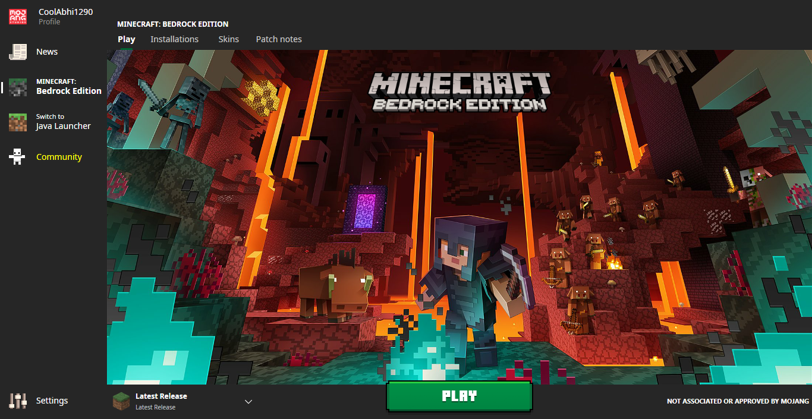
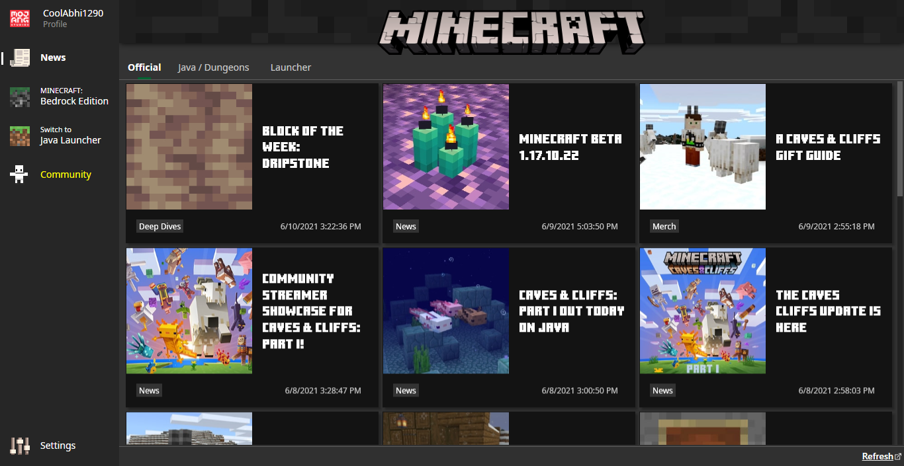
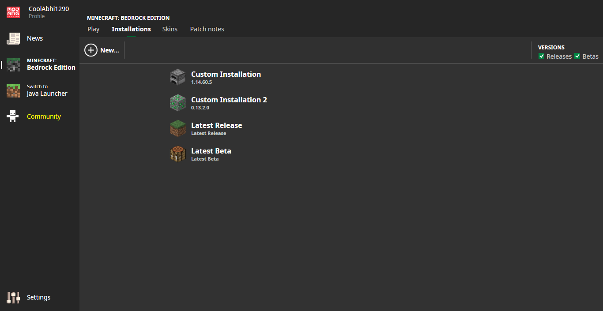
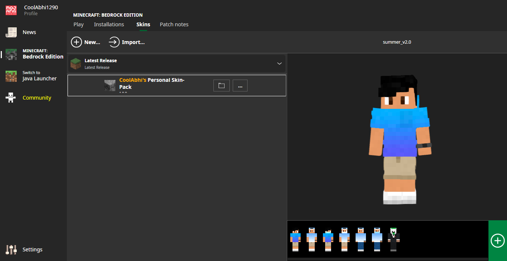
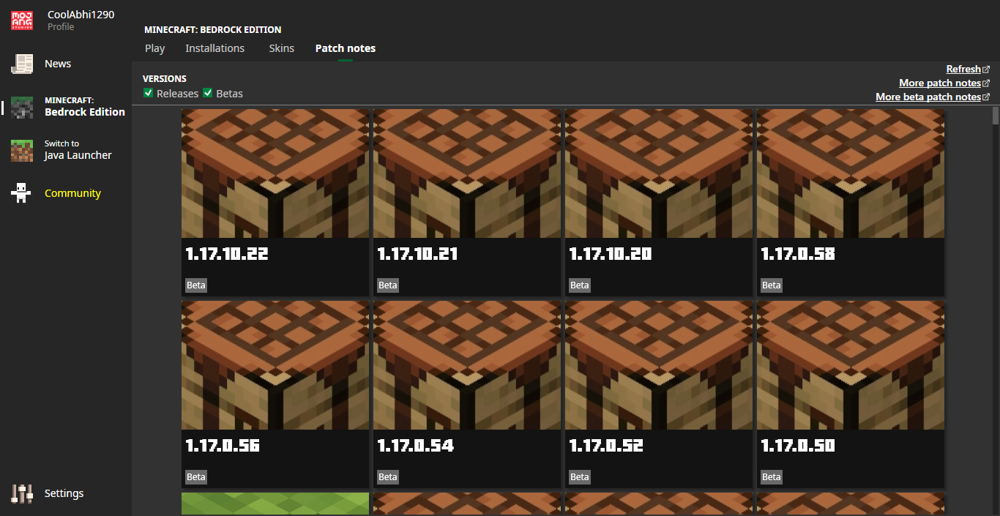
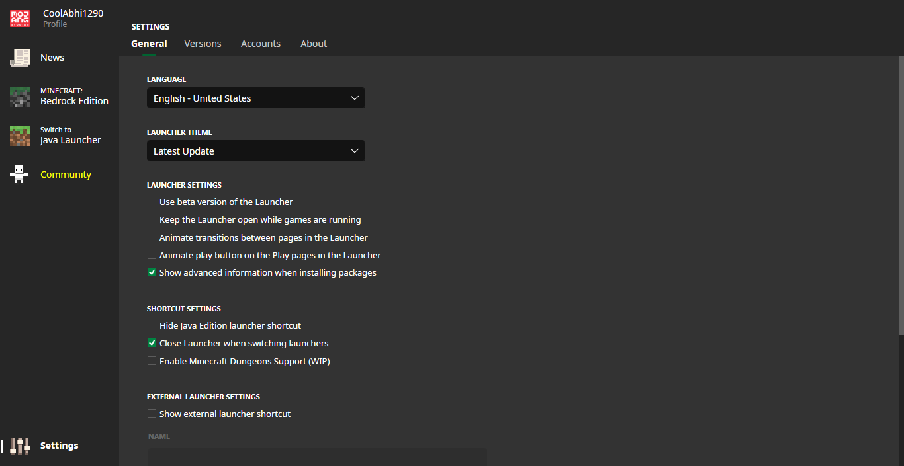
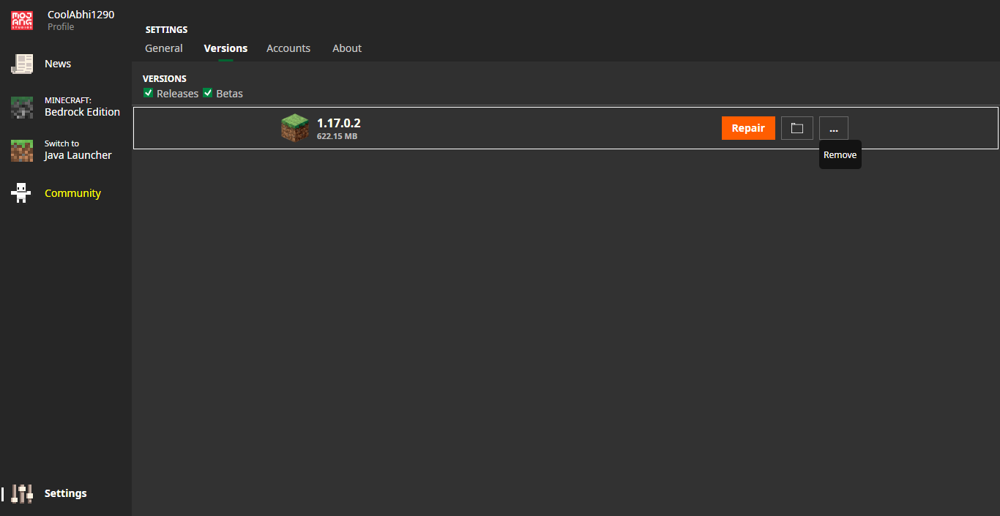
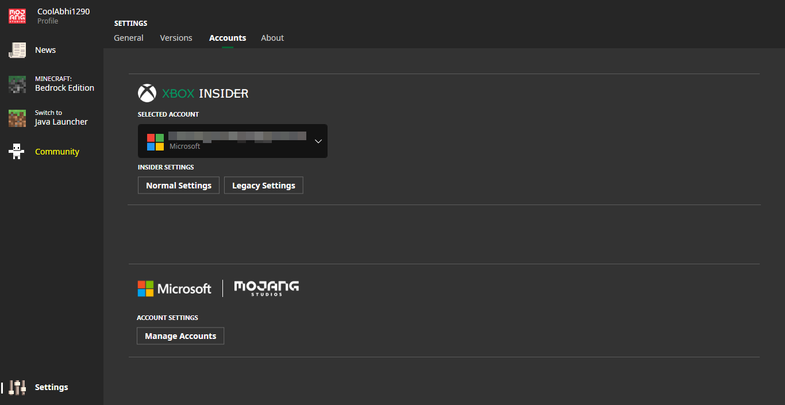
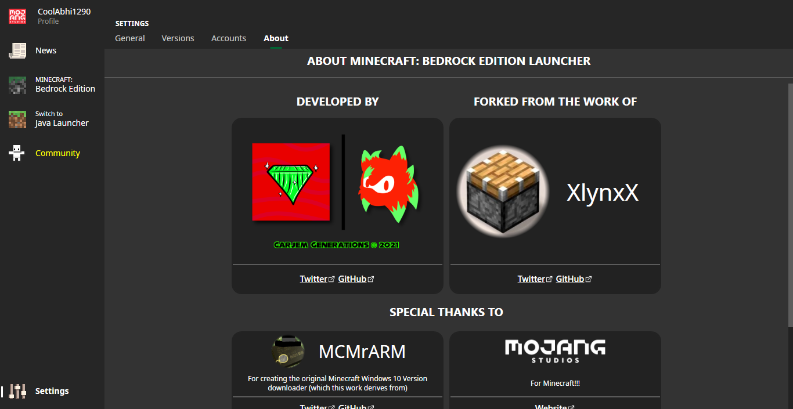
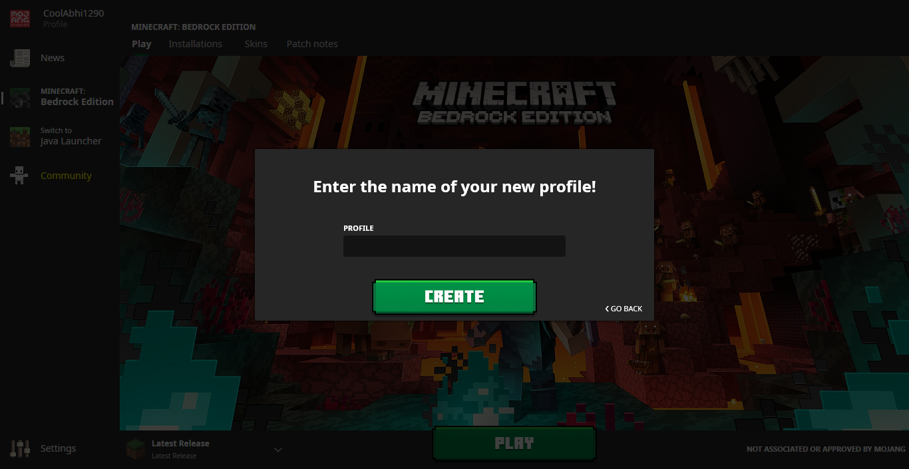

#  Minecraft Bedrock Launcher

An unofficial **Minecraft for Windows 10** launcher that enables similar features from the **Minecraft Java Edition Launcher**.

## Prerequisites
 - A device with [Windows 10](https://www.microsoft.com/en-us/d/d/d76qx4bznwk4)
 - A Windows account with administrator rights (tutorial: [Microsoft Support](https://support.microsoft.com/windows/20de74e0-ac7f-3502-a866-32915af2a34d))
 - A Microsoft account with **Minecraft for Windows 10** owned
 - 60+ Mb of storage capacity for the Launcher
 - 440~ Mb of storage for the Launcher
 - **Minecraft for Windows 10** beta sign-up (using non-legacy [Xbox Insider Hub](https://www.microsoft.com/p/p/9pldpg46g47z)) (tutorial: [silentwisperer](https://youtu.be/BtfegIv1K3s?t=300))

## Disclaimers
 - This tool will not let you pirate **Minecraft for Windows 10**, as this launcher requires you to own a copy of it from the [Microsoft Store](https://www.microsoft.com/p/p/9nblggh2jhxj).
 - This tool is in *early public beta*; hence there will be a lot of issues.
 - This tool is open source, and contributing is appreciated; however, redistributing the build is not recommended.
 - The [screenshots](#Screenshots) shown may not represent the actual product due to early rapid prototyping.

## Get the launcher
Install the launcher using the [dedicated installer](https://github.com/BedrockLauncher/BedrockLauncher/releases/latest/download/Installer.exe). Alternatively, you can go to the [releases tab](https://github.com/BedrockLauncher/BedrockLauncher/releases) to download a specific version.

## Compiling the launcher yourself
Be sure you have:
 - [Visual Studio 2019](https://visualstudio.microsoft.com/downloads/) with the following packages
    - [C++ Development Libraries](https://docs.microsoft.com/en-us/cpp/overview/visual-cpp-in-visual-studio)
    - [.NET Framework Development Libraries](https://visualstudio.microsoft.com/vs/features/net-development/)
 - [Node.js](https://nodejs.org/) (with the [npm](https://www.npmjs.com/) as a system environment path)
 - [Vcpkg Package Manager](https://github.com/microsoft/vcpkg) (for C++ Libs)
 - [PostSharp Community Edition](https://www.postsharp.net/) (for the installer)
 - **You Must be running as administrator to build!** (tutorial: [Microsoft Support](https://support.microsoft.com/windows/20de74e0-ac7f-3502-a866-32915af2a34d))

Open the [`.sln`](https://fileinfo.com/extension/sln) project file in [Visual Studio](https://visualstudio.microsoft.com/downloads/) with the following packages and Press the Build/Start Button.

## Screenshots
| Home tab | News tab |
|-|-|
|||

| Installations tab | Skins tab |
|-|-|
|||

| Patch-notes tab | General settings tab |
|-|-|
|||

| Versions settings tab | Accounts settings tab |
|-|-|
|||

| About tab | Add profile prompt |
|-|-|
|||

## Credits
 - Main developers
    -  [CarJem](https://github.com/CarJem) - Creator of **Minecraft Bedrock Launcher** based upon [BedrockLauncher](https://github.com/XlynxX/BedrockLauncher)
 - Forked from the work(s) of
     -  [MCMrARM](https://github.com/MCMrARM) - Original [MCLauncher](https://github.com/MCMrARM/mc-w10-version-launcher) creator
     -  [XlynxX](https://github.com/XlynxX) - Developer of [BedrockLauncher](https://github.com/XlynxX/BedrockLauncher) based upon [MCLauncher](https://github.com/MCMrARM/mc-w10-version-launcher)
     -  [Blessing Skin](https://github.com/bs-community/) - Creator of [skinview3d](https://github.com/bs-community/skinview3d)
 - General repository commitors
     -  [dktapps](https://github.com/dktapps)
     -  [CoolAbhi1290](https://github.com/CoolAbhi1290)

## Known issues
 - The launcher may not work until you download **Minecraft for Windows 10** from the [Microsoft Store](https://www.microsoft.com/p/p/9nblggh2jhxj) at least once
 - You need **Minecraft for Windows 10** beta sign-up (using non-legacy [Xbox Insider Hub](https://www.microsoft.com/p/p/9pldpg46g47z)) set up before downloading a beta version (Tutorial: [silentwisperer](https://youtu.be/BtfegIv1K3s?t=300))
